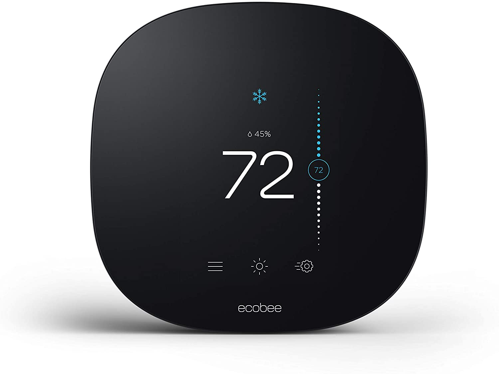

# Equipment name
 
 Ecobee 3 Lite

 #### Photograph of Equipment

 

 #### Component Data Sheets or Techical Manuals
 
 <a href="ecobee3_UserGuide.pdf">Ecobee 3 User Guide</a>

 #### General Installation Area (in-unit)

 > On wall near HVAC system
 > The lite model does not include the ecobee SmartSensor

 #### Expected Use-Case Scenario

 NOTE: the user has no direct ecobee software interaction, but they can manipulate the device manually

 All ecobee data is routed through our SLI Connect API, providing the tennant with an interface  
 that gives them almost all of the same functionality of the ecobee native app, minus account  
 interactions.

 #### Installation and Configuration Steps
 > 1. Wall mount bracket
 > 2. In a modern installation, the HVAC system should provide the following wires:
 > 2a. Rh, Rc, G, C, W/W1, Y/Y1
 > 2b. Connect these wires to the bracket.  Ensure secure connection.
 > 3. Connect the thermostat to the mount

 NOTE: no new build should require the Ecobee power adapter

 #### Expected Return Data Type and Sample

 > Include a valid JSON object  
 > or other data object  
 