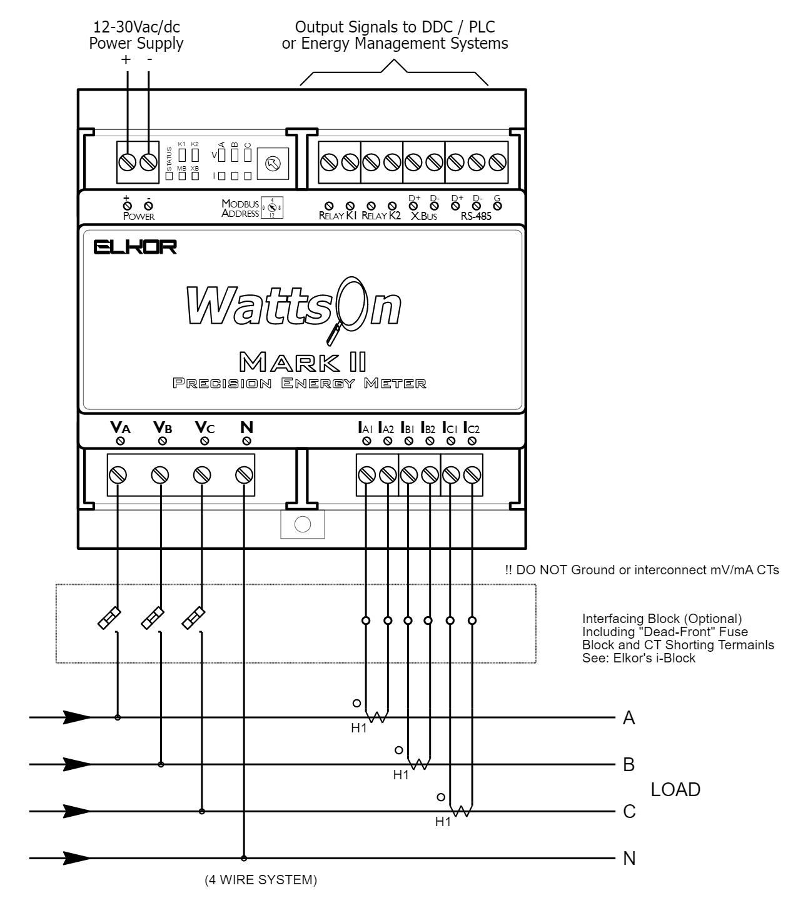

# Equipment name
 
 Elkor WattsOn 2

 #### Photograph of Equipment

 

 #### Component Data Sheets or Techical Manuals
 
 <a href="WattsOn-Mark_II_Manual.pdf"> WattsOn User Manual </a>

 <a href="Elkor Meter Documentation.pdf"> WattsOn Connection and Remote Access Manual</a>

 #### General Installation Area (in-unit)

 Name of unit location for installation

 #### Expected Use-Case Scenario

 NOTE: this component is not tennant-facing and should never be interacted with by anyone other than building managers

 Via SLI Building Manager App:
 > Electricity usage data on a per-unit basis
 > Electricity usage data for non-tennant areas

 Via Hub or SLI API:
 > Electricity usage alerts
 > Additional billing cycle information (if applicable)

 #### Installation and Configuration Steps

 NOTE: refer to the attached PDF to determine which wiring scheme is appropriate

 The following is a basic description of the installation process on a 4-wire WYE system
 > 1. With power to the unit turned off, place the CTs with correct polarity direction to the breaker inputs
 > 2. Connect the CTs to the bottom-left of the device (labeled IA-IC)
 > 3. CT orientation, polarity, and phasing must be taken into account when determining the correct installation methods  
 > 4. Using the following image, connect the remaining inputs on the lower-right to the same lines monitored by the CTs

 

 > 5. If using Modbus to read data from the meter, use RS485 cabling to connect to the top-right of the device
 > 5a. If using the Wattson with a persistent network connection, use a patch cable to connect the device to the unit's switch
 > 6. Power the device using either a DC power adapter or parasitic draw from the mains being monitored

 #### Expected Return Data Type and Sample

 > Instantaneous data (integer and floating point data points provided)
 > Accumulated data (integer and floating point data points provided)