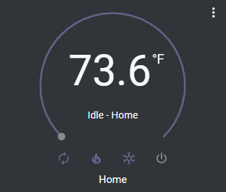
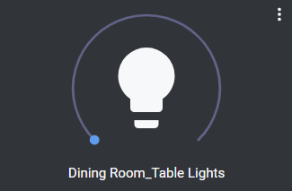
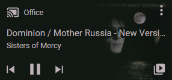
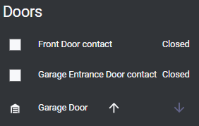
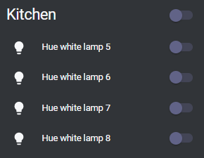
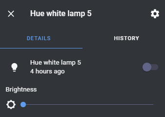

### Current Integrations

### Usage Notes

> 1. Software updates and core updates require rebooting the hardware
> 2. Core update on 8/17 took approximately 8 minutes, and the system update took ~10 minutes
> 3. After installing an un-configured Ruckus bridge in my system, I kept noticing the hub was  
>    intermittently unavailable.  I moved the hub outside of the bridge subnetwork and it stopped  
>    displaying these problems. 
> 4. If used in final build, HACS should be installed before any other configurations
> 5. First HA build completed on a RPi3 B+, with no additional hardware
> 6. Second HA build to be hosted on a RPi 4 B with a Zigbee/Zwave adapter

### REST API

<a href="https://developers.home-assistant.io/docs/api/rest/">REST API Documentation from HA</a>

### WebSocket API

<a href="https://developers.home-assistant.io/docs/api/websocket">WebSocket API Documentation from HA</a>

### Tested Hardware Integrations

The following software and hardware integrations have been tested on a HA setup

#### Ecobee

<a href="https://www.home-assistant.io/integrations/ecobee/">Ecobee Integration Documentation</a>

IoT Class:
> Cloud Polling

Through standard interface:
> Temperature
> Independent fan control (toggle)
> Heating / Cooling system

#### Lutron Caseta Ecosystem

<a href="https://www.home-assistant.io/integrations/lutron_caseta/">Lutron Caseta Integration Documentation</a>

IoT Class:
> Local Push

Through standard interface:
> Toggle light on / off
> Adjust brightness level of connected light

#### SmartThings

<a href="https://www.home-assistant.io/integrations/smartthings/">SmartThings Integration Documentation</a>

IoT Class:
> Cloud Push

Through standard interface:
> Sensor state

Through specific device entities:
> 1. Multipurpose Sensor
>   a. Contact (open/closed)
>   b. Temperature
>   c. Accelerometer state (axial coordinates)
>   d. Battery
> 2. Leak Sensor
>   a. Water detected
>   b. Temperature
>   c. Battery state

#### Yale Assure Smart Locks

NOTE: as of 8/23, the locks are currently installed without their radio units.

#### Sonos
NOTE: this integration is not currently a part of the SLI Connect tech package

<a href="https://www.home-assistant.io/integrations/sonos">Sonos Integration Documentation</a>

Through standard interface:
> Media playback control
> Volume
> As of the current HA build, there is no direct Sonos integration or control

#### MyQ Garage Door Opener  

NOTE: this integration is not currently a part of the SLI Connect tech package

<a href="https://www.home-assistant.io/integrations/myq">MyQ Integration Documentation</a>

NOTE: can be represented by a single-entity card as well

Through standard interface:
> Open / Close control
> Door state

#### Phillips Hue

NOTE: this integration is not currently a part of the SLI Connect tech package

 

 

<a href="https://www.home-assistant.io/integrations/hue">Phillips Hue Integration Documentation</a>

Through standard interface:
> Toggle light on / off
> Adjust brightness level of connected light
> When grouped, lights can be controlled individually, but the whole group cannot be controlled  
>      other than toggling the power

#### Roku

NOTE: this integration is not currently a part of the SLI Connect tech package

 

 

<a href="https://www.home-assistant.io/integrations/roku/">Roku Integration Documentation</a>

Through standard interface:
> Toggle TV power
> Control program playback (play/pause)
> Control TV volume (through App Control card)

