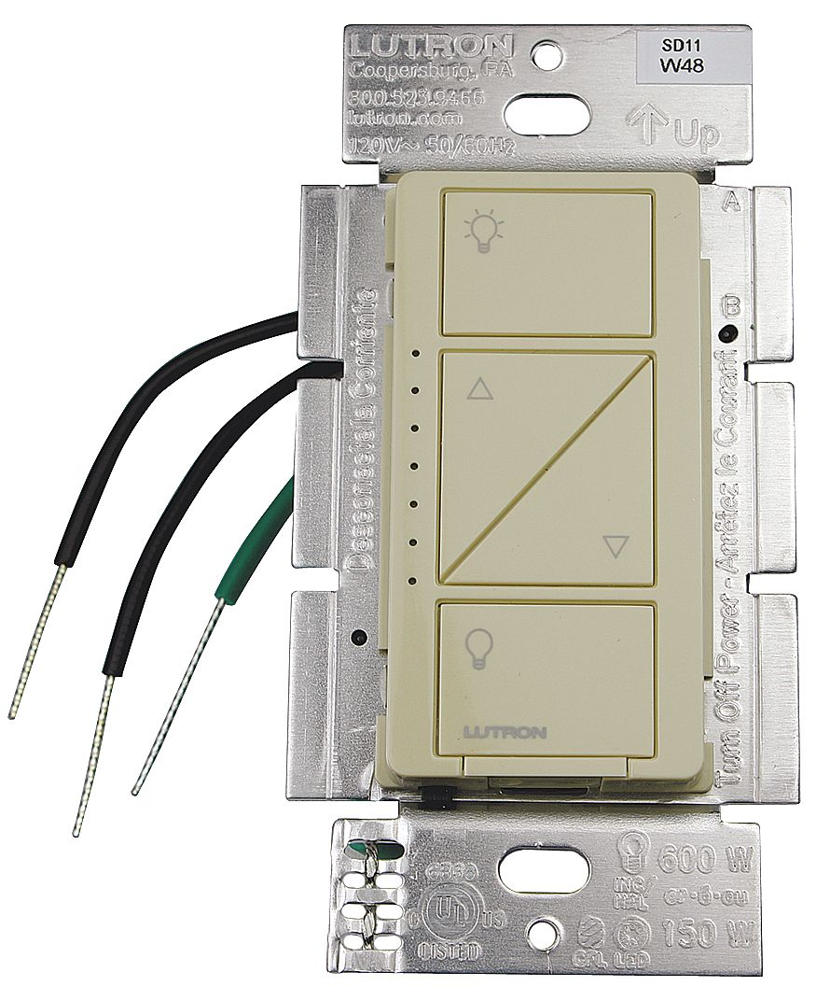

# Equipment name
 
 Lutron Smart Dimmer Switch (PD-6WCL)

 #### Photograph of Equipment

 

 #### Component Data Sheets or Techical Manuals
 
<a href="0301710a_Caseta Advanced Inst.pdf">Link to advanced Lutron switch installation guide</a>

 #### General Installation Area (in-unit)

- In-wall, client-facing  
- Controlling a dimmable light source or variable-speed fan  
- Single-pole

 #### Expected Use-Case Scenario

- Surface of controller has four buttons
- Two dimmer buttons in the center
- Sequence of green LEDs on the left side of switch to indicate relative dimmer level  

 #### Installation and Configuration Steps
 > Using twist-on wire connectors:
 > 1. Connnect green ground wire in wall to green wire on switch  
 > 2. Connect either of the remaining wires to either black wire on the back of the switch  
 > 3. Open Lutron App
 > 4. Hold down the bottom button on the switch until the array of green LEDs flash rapidly
 > 5. Using the Lutron app, assign the switch to a designated area

 #### Expected Return Data Type and Sample

 > State Data:
 > 1. On / Off
 > 2. Relative dimmer level

 