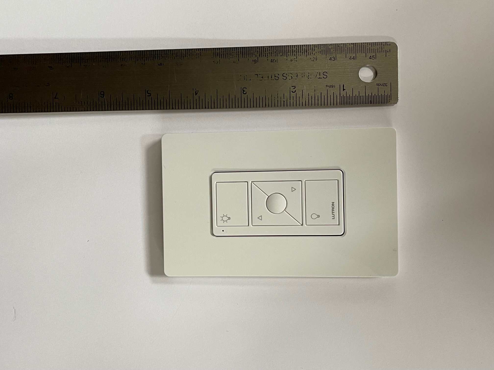
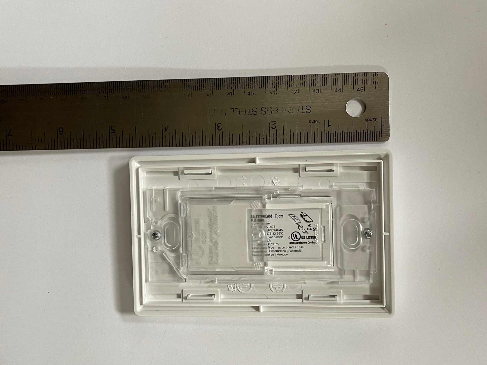
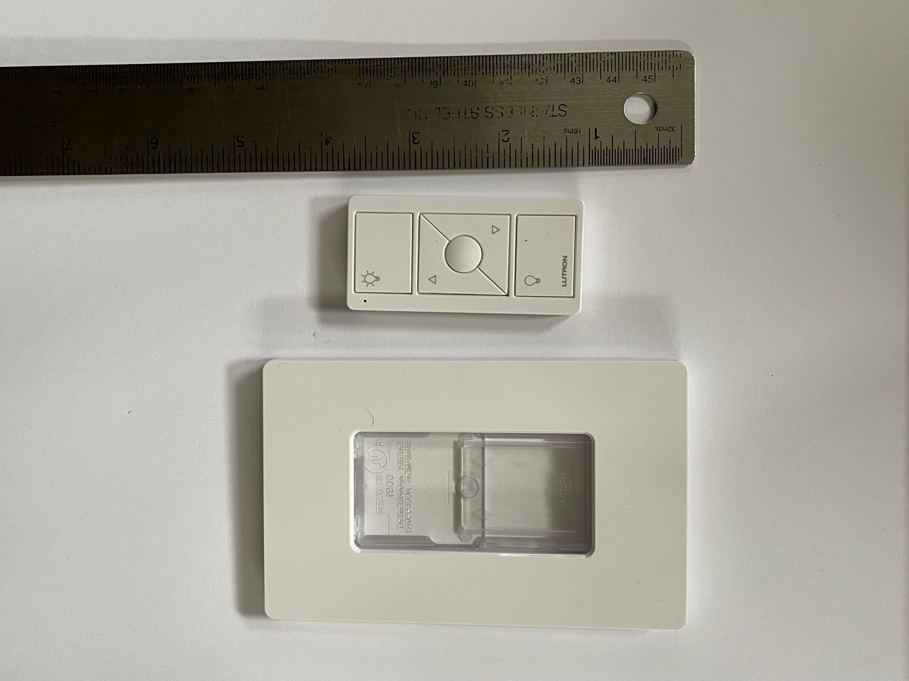

# Equipment name
 
 Lutron Pico Remote (PJ2-3BRL)

 #### Photograph of Equipment

 #### Component Data Sheets or Techical Manuals
 
<a href="0301710a_Caseta Advanced Inst.pdf">Link to advanced Lutron switch installation guide</a>

 #### General Installation Area (in-unit)

 The remote can be installed:
 1. On the wall via a separate mount (CW-1)
 or 
 2. On a furniture-mountable holder (L-PED1-WH)

 #### Expected Use-Case Scenario

The Remote can be paired to the Lutron hub and assigned to control either:
Room Lights
or
Sonos System

 #### Installation and Configuration Steps
 > The wall-mount is a screwless faceplate that can fill any one-gang spot or be attached to an uncut portion of the wall
 > The remote can also operate separate from any kind of holder

 > 1. Open the Lutron app
 > 2. Select "add device" from settings
 > 3. Select Pico Remote from the provided list
 > 4. When prompted, hold the bottom button of the remote for 10 seconds, until the green indicator LED flashes

 #### Expected Return Data Type and Sample

 > Does not collect or generate data, but updates states instead