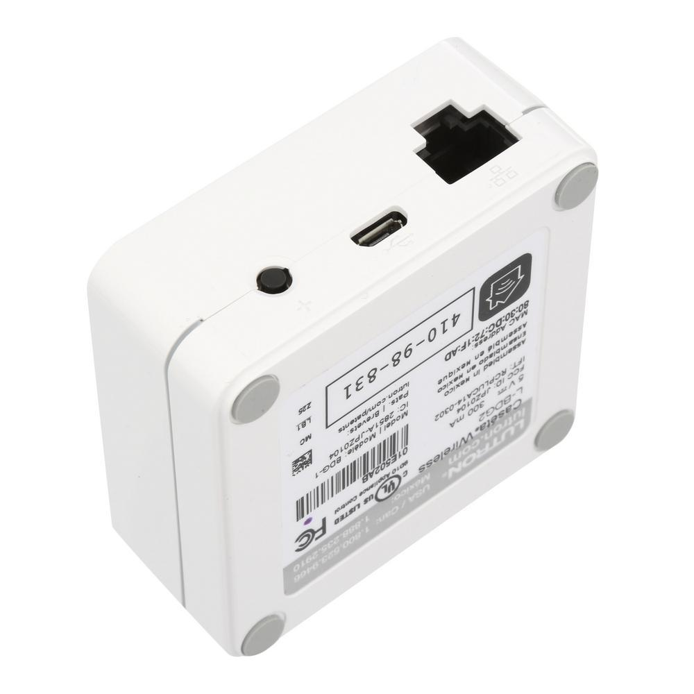

# Equipment name
 
 Lutron Smart Bridge Pro  

 #### Photograph of Equipment

 

 #### Component Data Sheets or Techical Manuals
 
 <a href="caseta_smart_bridge_pro.pdf">Link to official Lutron installation guide</a>

 #### General Installation Area (in-unit)

 In-wall, on IoT utility sled

 #### Expected Use-Case Scenario

- One per unit , designated switch control

 #### Installation and Configuration Steps
 > 1. Connect hub to router
 > 2. Connect hub to power  
 > 3. Configure via Lutron Caseta app  

Anecdotal Installation Record

 > 8/21: Lutron Caseta app has been replaced with Lutron App
 > 1. In, app: homeowner or professional (jbest: configured as homeowner for initial setup) 
 > 2. On initial connection to the internet, the bridge will download firmware updates.  This can take 15 minues. Light on device displays in a circular pattern.
 > 3. Configuration on app was automatic (did not need to select "HUB" or other device to pair)

 #### Expected Return Data Type and Sample

 > None through hub.  Data managed in current build via Samsung API

 #### Installation concerns
> Updating firmware requires an open ethernet connection.  If traffic is monitored onsite, how can we assure the device can retrieve updates reliably?
>  
> IMPORTANT INSTALLATION NOTE: all Lutron devices must be configured before they are connected to the SmartThings system

 