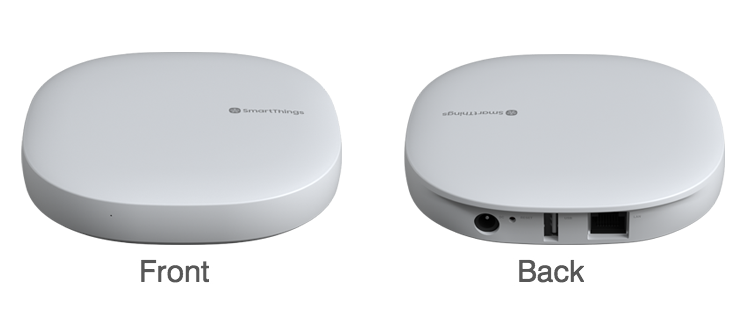

# Equipment name
 
 Smartthings Hub (v3)

 #### Photograph of Equipment

 

 #### Component Data Sheets or Techical Manuals
 
 Local documentation not provided by Samsung

 <a href="https://www.samsung.com/us/support/smart-home/smartthings/hubs/smartthings-hub/"> Online documentation and support</a>
 
 #### General Installation Area (in-unit)

 - In-wall  
 - In Primax or other enclosure
 - Within 30 feet of all sensors or repeaters

 #### Expected Use-Case Scenario

 NOTE: tennants do not have direct access to the Smartthings hub

 - The hub controls and monitors the states of all connected sensors
 - The hub manages all Lutron-associated controllers
 - The hub also can manage any Zigbee device

 #### Installation and Configuration Steps
 > 1. Connect Hub to ethernet
 > 2. Connect Hub to Power
 > 2a. If the hub has been moved from one unit to another, use a pin to reset the device
 > 2b. To reset: insert pin into "Reset" port while the hub is unplugged.  Plug the DC adapter back into the hub while holding the pin in the Reset port. The light will rapidly flash orange, and when it turns solid, remove the pin.
 > 2c. The hub is ready for pairing when the front light is solid green

 Notes from home lab installation:
 > Blinking Green status light: applying update, downloading software, or pairing with sensor device
 > The first time you pair any sensors with hub, it must download the connected firmware to the hub, which can take some time.  Each subsequent pairing of the SAME sensor will take significantly less time.

 #### Expected Return Data Type and Sample

 > Include a valid JSON object  
 > or other data object  
 