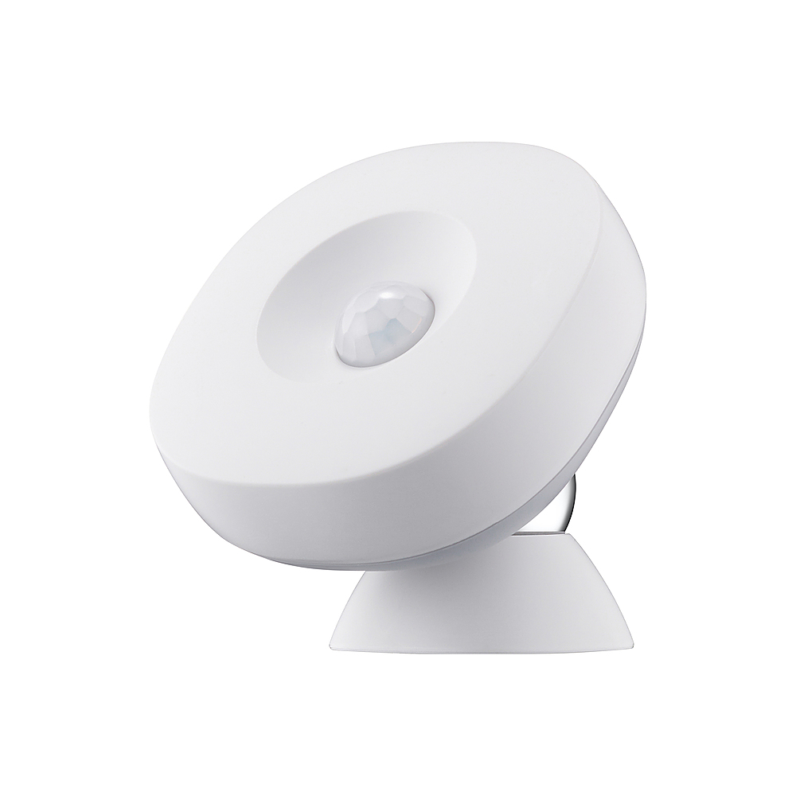

# Equipment name
 
 Sample Name

 #### Photograph of Equipment
 

 #### Component Data Sheets or Techical Manuals
 
 Local documentation not provided by Samsung
 <a href="https://www.samsung.com/us/support/smart-home/smartthings/hubs/smartthings-hub/"> Online documentation and support</a>

 #### General Installation Area (in-unit)

 The motion/presence sensor can be installed anywhere overhead.  For best results:
 > place in location with variable foot traffic to control energy use (i.e. lights in mail room)
 > place in empty tennant units to maintain an understanding of who occupies that space

 NOTE: this device is not a camera and records no image or other sensor data other than what is listed below.

 #### Expected Use-Case Scenario
 
 NOTE: this device is not tennant-facing in the sense that they can directly access its data

 Building managers can use the sensor to:
 > determine occupancy
 > measure intervals between occupancy
 > control lights/HVAC systems based on occupancy

 #### Installation and Configuration Steps
 > 1. Open the package and remove the sensor from the box. DO NOT REMOVE THE BATTERY TAG UNTIL PROMPTED  
 > 2. In the Samsung app main screen, tap the " + " icon and select "Add Device" on the subsequent screen
 > 3. Select "Scan QR code" on the bottom-left corner of the screen
 > 4. Scan the QR code to connect that specific device to the Samsung account
 > 5. Associate the sensor with the appropriate hub and label according to it's installation location
 > 6. Remove the battery tag when prompted by on-screen instruction
 > 7. Wait to install the sensor until the pairing process is complete.  This can take several minutes.

 If installing a sensor used with another Smartthings Hub:
 > 1. Replace the CR 2 (3V) battery (if sensor was used for > 1 year)
 > 2. Separate the halves of the sensor
 > 3. Insert a paper-clip or pin into the factory reset hole
 > 4. Continue to press the reset button until the LED begins to flash red (and subsequently green)
 > 5. If the LED does not illuminate when you press the reset button:
 > 5a. Replace the battery with another cell.
 > 5b. Attempt to re-seat the pin or other device you're using until the LED activates

 #### Expected Return Data Type and Sample

 > Presence detected (PIR sensor)
 > Temperature
 > Battery level
 