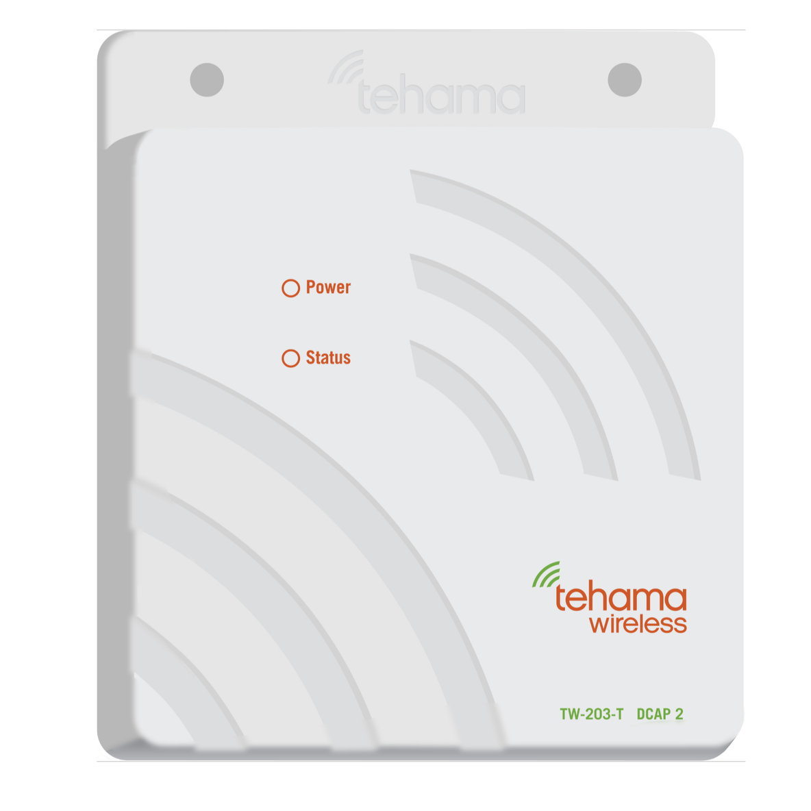

# Equipment name
 
 Tehama Wireless MDT (Metering Data Transceiver) and Tehama DCAP (Data Concentrating Access Point)

 #### Photograph of Equipment

 
 

 #### Component Data Sheets or Techical Manuals
 
 <a href="MDT-MAX+Range+Encoder+MDT+Data+Sheet-2001.pdf">MDT Electronic Data Sheet</a>

 <a href="MAX+DCAP+Data+Sheet-1902.pdf">DCAP Data Sheet</a>

 #### General Installation Area (in-unit)

 Water meters will be installed outside every unit for both metering and diagnostic purposes.
 > MDT employs LoRa communication technology
 > MDT takes two AA batteries that need to be replaced every 5 years with standard use
 > One DCAP is required per building, and can handle up to 250 MDTs

 #### Expected Use-Case Scenario
 Whereas the tennant will never interact with the device, user data COULD be relayed indirectly

 Otherwise, the device will be used to:
 > Collect water metering data
 > Identify potential leaks/incongruities between water delivered and water used

 #### Installation and Configuration Steps
 > 1. Configure DCAP first by using the Tehama-provided Configuration and Installation Tool (CIT)
 > 2. After installation of the CIT, connect the DCAP to the local network via ethernet cable, followed by powering on the device.
 > 3. Connect the DCAP to the computer with the CIT installed and follow on-screen instructions
 > 4. On the front of the MDT, there is a hidden reset button located in the top-right quadrant of the device.  The button's location is identified in the accompanying PDF data sheets
 > 5. Reset the MDT using this hidden button
 > 6. In the CIT tool, look for unregistered MDTs. Select the serial number of the unit you want to associate with the DCAP, and right click on the serial number on the left of the screen.  Select "Add this uncommissioned device" from the contextual menu and attach any monitors you need to the DCAP

 #### Expected Return Data Type and Sample

 > Water use (as CSV file delivered via FTP)
 