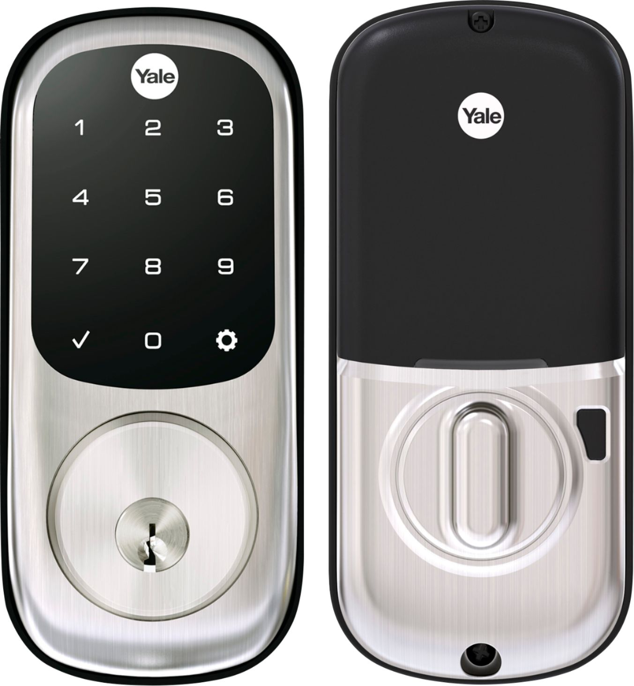

# Equipment name
 
 Yale Assure Lock (YRD226)
 Base model w/o radio units

 #### Photograph of Equipment

 

 #### Component Data Sheets or Techical Manuals
 
 <a href="YRD226-MNL-0001 Rev I_WEB_zwpE_zbC.pdf">Yale Assure Lock Installation Instructions</a>

 #### General Installation Area (in-unit)

 > Tennant front doors
 > Utility closets
 > Trash rooms
 > Other mixed-occupancy spaces that require occasional re-keying/re-coding

 #### Expected Use-Case Scenario

 Tennant:
 > 1. Use standard key
 > 2. Use assigned entry code

 Building Manager:
 > 1. Remotely manage tennant codes
 > 2. Remotely give access to tennant if locked out or forgot code

 NOTE: tennant should NOT be given access to the master code for the door

 #### Installation and Configuration Steps

 > 1. Install latch and strike plate
 > 1a. The deadbolt position can be adjusted based on backset
 > 2. Install the front keypad:
 > 2a. Ensure the rubber gasket is connected on all four points on the back of the front keypad unit
 > 2b. Thread the cable bundle underneath the deadbolt
 > 2c. The mechanism extending laterally from the back side of the keypad unit should be
 >     directed through the retracted, central, rectangular hole of the daedbolt
 > 3. Install the inside mounting plate
 > 3a. Ensure the rubber gasket is connected on all four points to the back of the mounting plate
 > 3b. Thread the cable bundle through the central opening, and settling them into the labeled cable hole
 > 3c. Ensure the small metal extrusion near the bottom of the circular opening of the inside mounting plate
       is directed through the small rectangular opening in the black plastic of the exposed front keypad behind the deadbolt
 > 3d. Securely fasten the inside mounting plate to the front keypad using provided bolts.
 > 4. Remove the battery cover on the inside lock unit
 > 5. Connect the cable bundle to the central cable connector on the backside PCB on the inside lock unit
 > 6. Using three provided small black bolts, attach the inside lock unit to the inside mounting plate
 > 7. Install batteries
 > 8. Replace battery cover
 > 9. Interacting with the front key pad, follow setup procedure:
 > 9a. Tap Yale logo
 > 9b. Tap gear button and wait for instructions
 > 9c. Enter master code

 To create an entry code:
 > 1. Tap Yale logo to wake lock
 > 2. Press GEAR
 > 3. Press 2, followed by GEAR
 > 4. Press 1, followed by GEAR
 > 5. Press the desired keycode, followed by GEAR
 > 5a. The new code should flash on the keypad
 > 6. If you want to add another code or codes, press GEAR, type the new code, and press GEAR again
 > 7. When finished, press the CHECK MARK

 To remove entry code:
 > 1. Tap Yale logo to wake lock
 > 2. Press GEAR
 > 3. Press 2, followed by GEAR
 > 4. Press 3, followed by GEAR
 > 5. Press the keycode you want to remove, followed by GEAR

 To remove ALL entry codes except for the master code:
 > 1. Tap Yale logo to wake lock
 > 2. Press GEAR
 > 3. Press 2, followed by GEAR
 > 4. Press 3, followed by GEAR
 > 5. Press 0 0 (zero zero), followed by GEAR

 #### Expected Return Data Type and Sample

 > Lock state
 > Wireless connection status (with radio module installed)
 
 