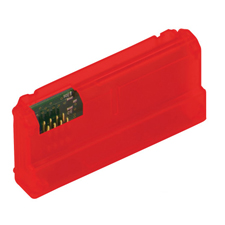

# Equipment name
 
 Yale Zigbee Module
 AYR202-ZB-HA

 #### Photograph of Equipment

 

 #### Component Data Sheets or Techical Manuals
 
 Electronic manual not provided by Yale

 #### General Installation Area (in-unit)

 All Yale wireless modules are 8-pin radio units that are installed in the battery compartment of the interior lock. 

 #### Expected Use-Case Scenario

 Provides Zigbee connecton between the lock and whatever Zigbee hub is installed on-site

 #### Installation and Configuration Steps
 > 1. Remove the battery cover
 > 2. Remove batteries
 > 3. Insert the unit aligned with the unit's unique shape
 > 4. Replace the batteries and the battery cover
 > 5. In the Zigbee app of choice (Home Assistant or SmartThings), begin the device discovery process
 > 6. On the front of the lock, tap the Yale logo and enter your master passcode, then tap the GEAR icon
 > 7. Tap 7 and the GEAR icon
 > 8. Tap 1 and the GEAR icon.  The lock will audibly confirm connection.
 > 9. In your Zigbee-connected app, control the lock/get the state via zigbee entitythat

 #### Expected Return Data Type and Sample

 > Open / Closed State
 > Battery State
 